# Imperial Cloud Security Lab - Insider Threat Detection and Response

## Overview

This project is a hands-on AWS cloud security lab designed to simulate a realistic insider threat scenario. The goal of the project was not just to deploy cloud infrastructure, but to walk through the full security lifecycle:

1. Build the AWS environment with Terraform

2. Configure logging and detection

3. Simulate malicious insider activity

4. Investigate the activity using CloudTrail

5. Apply remediation actions to contain the threat

I created this project to demonstrate practical cloud security skills that are directly relevant to a Cloud Security Analyst role, including AWS IAM security, logging, detection, investigation, and incident response.

---

## Project Goals

The main goals of this lab were:

- Build AWS infrastructure using Terraform

- Create a realistic IAM-based insider threat scenario

- Generate suspicious command-line activity

- Review logs in CloudTrail

- Validate security visibility with GuardDuty

- Perform incident response remediation

---

## Technologies Used

- AWS IAM

- AWS EC2

- AWS VPC

- AWS S3

- AWS CloudTrail

- AWS GuardDuty

- Terraform

- AWS CLI

- GitHub

---

## Environment Summary

This lab environment included:

- A custom VPC called `Death-Star-VPC`

- An EC2 instance called `death-star-instance`

- A CloudTrail trail called `imperial-cloudtrail`

- An S3 bucket for log storage

- GuardDuty for threat detection

- Multiple IAM users to simulate different roles in the environment

IAM users in the lab:

- `rogue-moff` — insider threat / overprivileged user

- `rebel-hacker` — malicious backdoor account created by rogue-moff

- `stormtrooper-user` — normal low-privilege user

- `Terraform-User` — automation account used to deploy the lab

---

## Step 1 - Terraform Initialization

I began by initializing Terraform in my project directory so Terraform could download the AWS provider and prepare the environment for deployment.

This step confirmed that Terraform was installed correctly and that the project directory was properly configured.

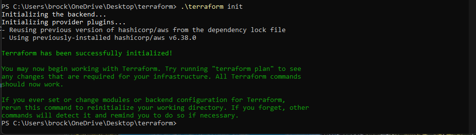

---

## Step 2 - Deploying the EC2 Instance

After initializing Terraform, I deployed the EC2 instance that would act as part of the cloud lab environment. This instance was named `death-star-instance`.

This screenshot shows the EC2 instance running successfully in AWS, confirming that infrastructure deployment was working as intended.

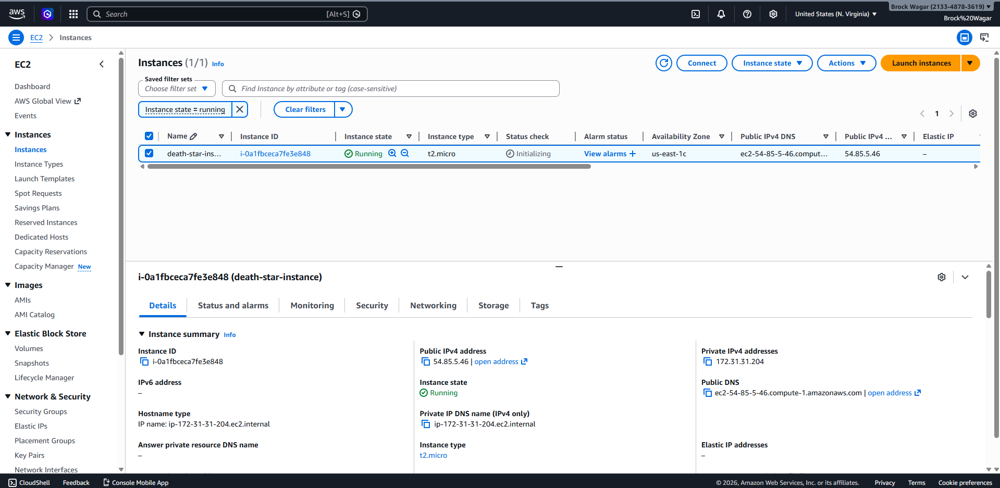

---

## Step 3 - Creating the Overprivileged Insider Account

I created the `rogue-moff` IAM user to simulate an insider threat. This user was intentionally given elevated privileges so that it could perform dangerous IAM actions such as creating users, attaching policies, and generating access keys.

This screenshot shows that `rogue-moff` had administrative permissions, which is central to the attack scenario.

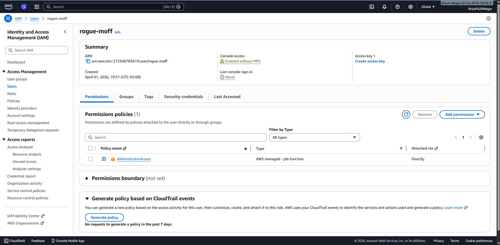

---

## Step 4 - Establishing a Baseline Normal User

I also created a normal IAM user called `stormtrooper-user` with no elevated permissions. This user served as a baseline example of what a standard low-privilege account should look like.

This comparison helps highlight why `rogue-moff` was risky.

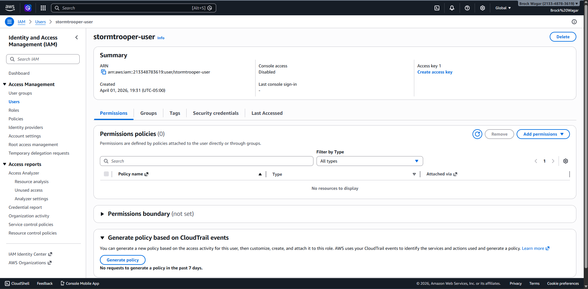

---

## Step 5 - Terraform Automation Account

To separate infrastructure deployment from the attack simulation, I used a `Terraform-User` account for automation. This user represented the trusted account used to deploy the environment via Infrastructure as Code.

This shows that the environment was not built entirely through manual console clicking and instead used automation.

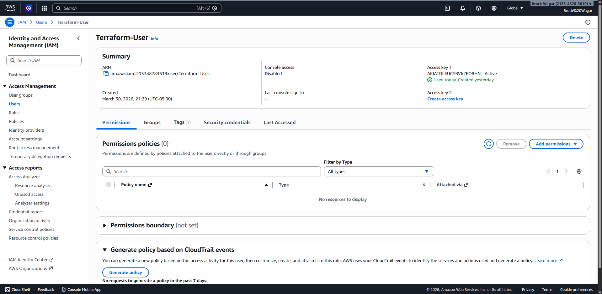

---

## Step 6 - Enabling CloudTrail Logging

CloudTrail was enabled to capture management events across the AWS account. This was a critical part of the lab because CloudTrail served as the main source of truth for investigating attacker behavior.

This screenshot shows that the `imperial-cloudtrail` trail was enabled and actively configured.

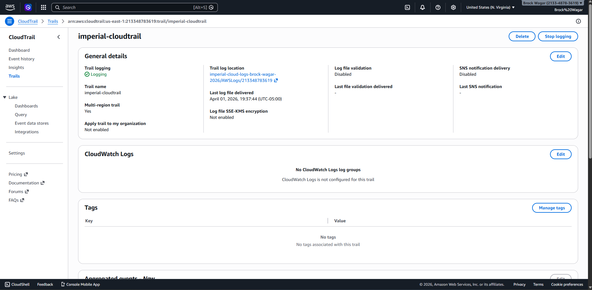

---

## Step 7 - GuardDuty Detection

GuardDuty was also enabled as part of the lab to provide managed threat detection. While GuardDuty did not alert on every suspicious IAM action in this project, it still generated findings related to root credential usage.

This is an important takeaway because it reflects a real-world lesson: security teams should not rely on only one detection tool.

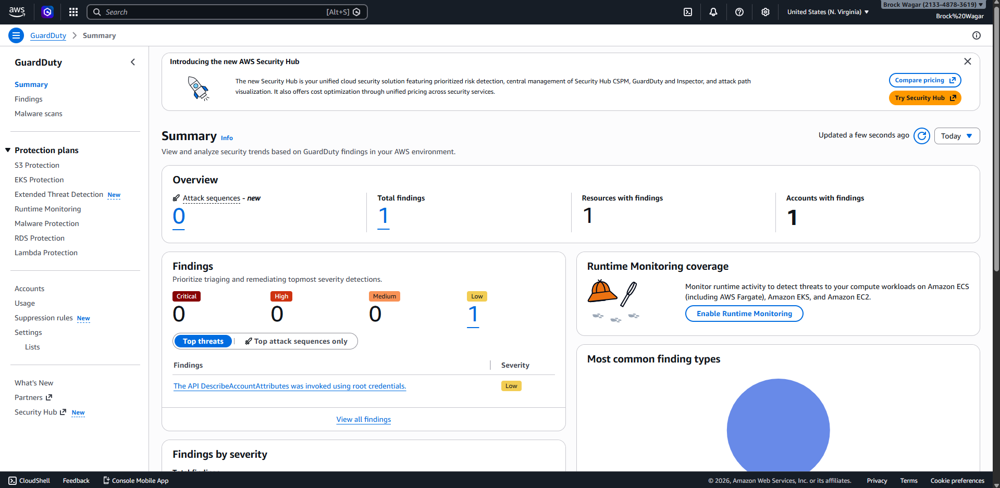

---

## Step 8 - S3 Log Storage

CloudTrail logs were stored in an S3 bucket so that events would be centrally retained for investigation. This demonstrates the logging pipeline used in the environment.

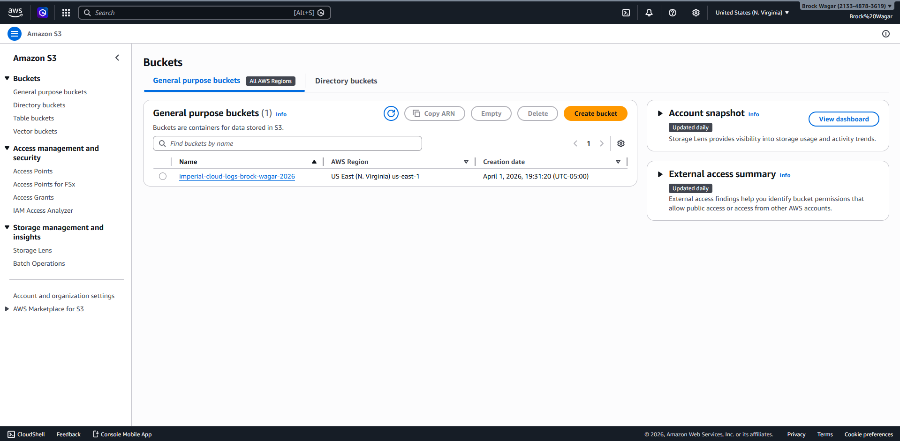

---

## Step 9 - VPC Deployment

The project also included custom networking components. This screenshot shows the deployed VPC used in the lab.

This added more realism to the environment by moving beyond just IAM and adding cloud network infrastructure.

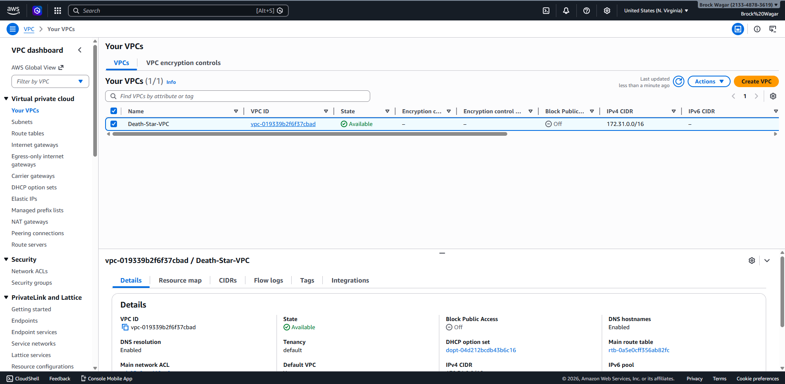

---

## Step 10 - VPC Resource Map

This screenshot shows the broader VPC architecture, including subnets and supporting network resources.

This helped document the environment layout and showed that the project included architecture planning, not just security monitoring.

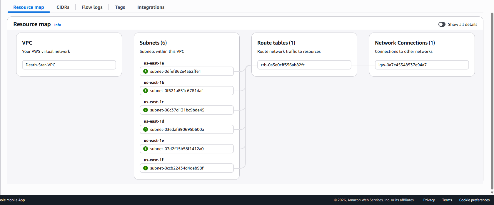

---

## Step 11 - Insider Threat Creates Backdoor Account

To simulate malicious insider behavior, I used the `rogue-moff` account from the AWS CLI to create a backdoor account called `rebel-hacker`, assign powerful permissions, and generate credentials.

This screenshot is important because it shows the attack being executed from the command line, which is more realistic than just using the AWS console.

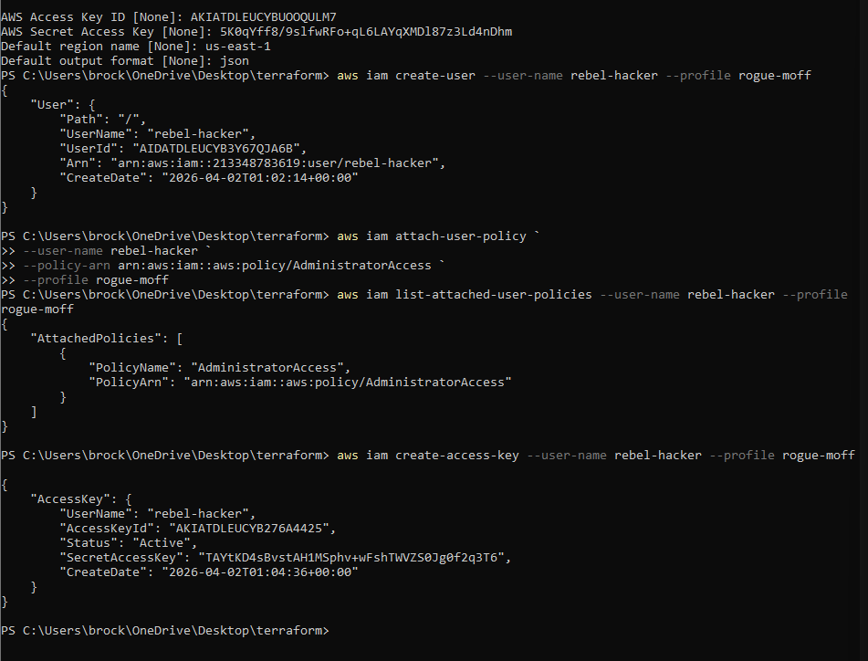

### Why this mattered

This simulated three major attacker behaviors:

- account creation

- privilege escalation

- persistence through access keys

---

## Step 12 - Attacker Enumerates IAM Users

After creating the backdoor account, I used the `rebel-hacker` account to enumerate IAM users from the command line.

This simulated an attacker attempting to map the environment and identify other users, including privileged accounts and automation accounts.

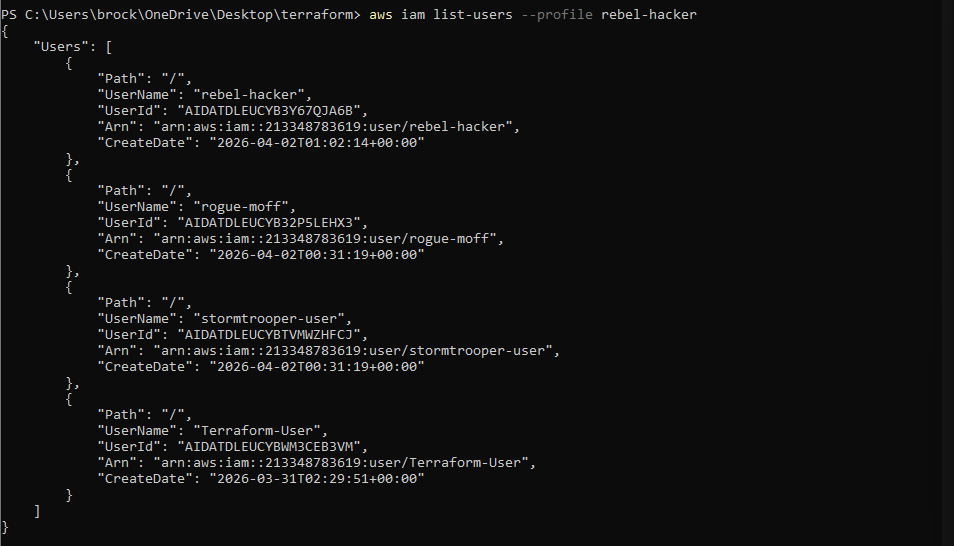

---

## Step 13 - Attacker Enumerates IAM Roles

The next step in the attacker workflow was IAM role enumeration. This is a realistic follow-up action because attackers often look for privilege escalation paths or high-value targets after gaining access.

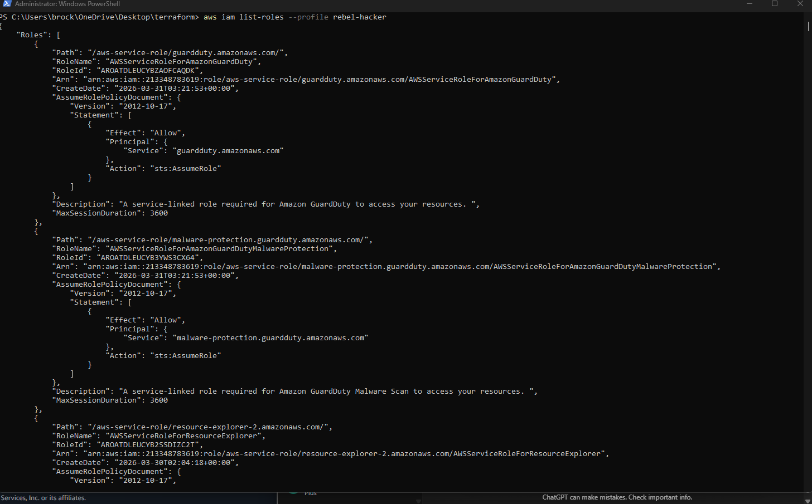

---

## Step 14 - CloudTrail Investigation of Attacker Activity

After generating attacker activity, I investigated the `rebel-hacker` account in CloudTrail. This screenshot shows the sequence of suspicious API actions that were captured, including identity checks and enumeration activity.

This is one of the most important screenshots in the project because it shows how a cloud security analyst would validate suspicious activity using audit logs.

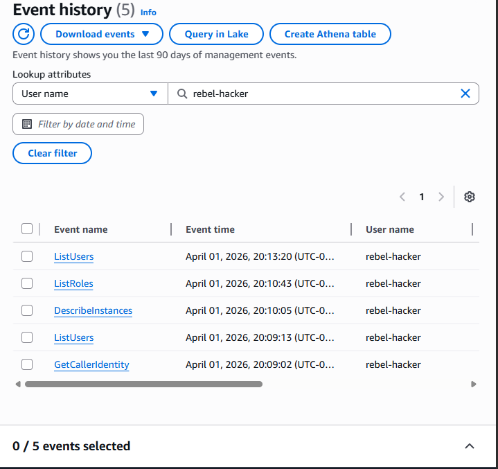

### Events observed

- `GetCallerIdentity`

- `ListUsers`

- `ListRoles`

- `DescribeInstances`

These actions are consistent with reconnaissance behavior after initial access.

---

## Step 15 - CloudTrail Investigation of Privilege Escalation

I also reviewed CloudTrail events associated with the `rogue-moff` account. This screenshot shows the earlier phase of the attack in which the insider threat account created the backdoor user, attached administrative privileges, and created access keys.

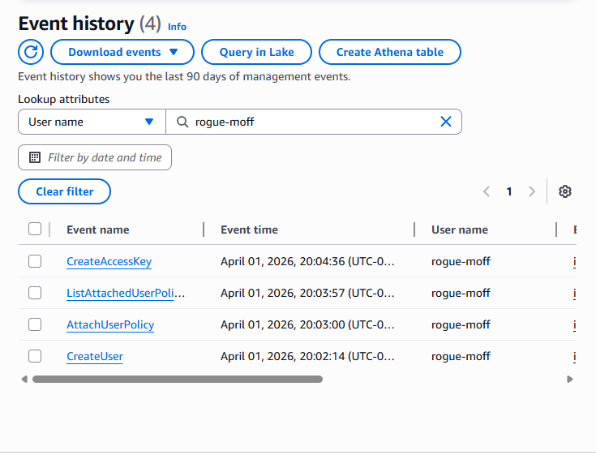

### Events observed

- `CreateUser`

- `AttachUserPolicy`

- `CreateAccessKey`

This completed the initial attack chain and clearly documented the privilege escalation process.

---

## Step 16 - Incident Response and Remediation

Once the malicious activity had been investigated, I applied remediation by creating and attaching a deny policy to disable the malicious insider account.

This represented the containment phase of the incident response process. Instead of trusting the compromised user, I moved to block all actions for the account.

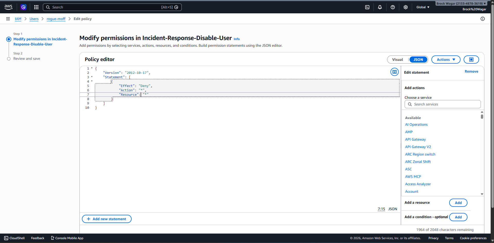

### Remediation goal

- contain the threat

- prevent additional actions

- demonstrate real incident response behavior

---

## Step 17 - Incident Response Verification

After applying the deny policy to the `rogue-moff` account, I verified the remediation actions using AWS CloudTrail. This step is important in a real-world incident response process to confirm that containment actions were successfully executed and logged.

I filtered CloudTrail logs for the **root** user to review the administrative actions taken during remediation. The event logs show the deny policy being applied and additional administrative actions taken to secure the compromised account.

This verification confirmed that the malicious account had been successfully contained and that all remediation steps were properly recorded.

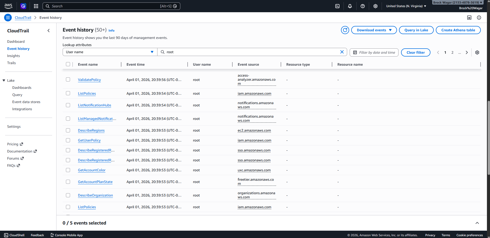

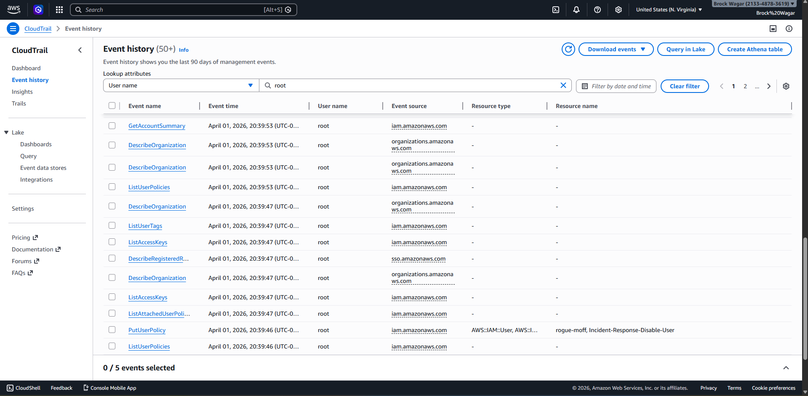

### Events observed

- PutUserPolicy  
- ListAccessKeys  
- ListAttachedUserPolicies  
- ListUserPolicies  
- GetAccountSummary  

### Verification goal

- confirm remediation actions were successful  
- validate containment of malicious account  
- document incident response activity  
- preserve audit trail for investigation

## Full Attack Timeline

The project followed this sequence:

1. Terraform environment initialized

2. AWS environment deployed

3. Overprivileged insider account established

4. CloudTrail and GuardDuty enabled

5. Insider (`rogue-moff`) created `rebel-hacker`

6. Insider granted administrative privileges

7. Insider created access keys for persistence

8. Backdoor account performed reconnaissance

9. CloudTrail logs were reviewed for evidence

10. Root / trusted admin account applied a deny policy to contain the threat

---

## Key Security Lessons

This lab reinforced several important cloud security concepts:

### Least privilege matters

The `rogue-moff` account was intentionally overprivileged. This showed how dangerous excessive IAM permissions can be.

### CloudTrail is critical

Even when GuardDuty did not alert on every step, CloudTrail still preserved the full sequence of attacker behavior.

### CLI activity can be highly valuable in labs

Generating activity from the command line made the simulation more realistic and helped create stronger evidence for investigation.

### Incident response is more than detection

The project did not stop at identifying suspicious activity. It also included containment and remediation, which made the lab more complete and realistic.

---

## Skills Demonstrated

This project demonstrates experience with:

- AWS IAM security

- privilege escalation scenarios

- cloud reconnaissance behavior

- CloudTrail log investigation

- GuardDuty monitoring

- incident response containment

- Infrastructure as Code with Terraform

- AWS CLI attack simulation

- cloud security documentation

---

## Terraform Code

The Terraform configuration used to deploy this environment is included in:

Terraform/main.tf